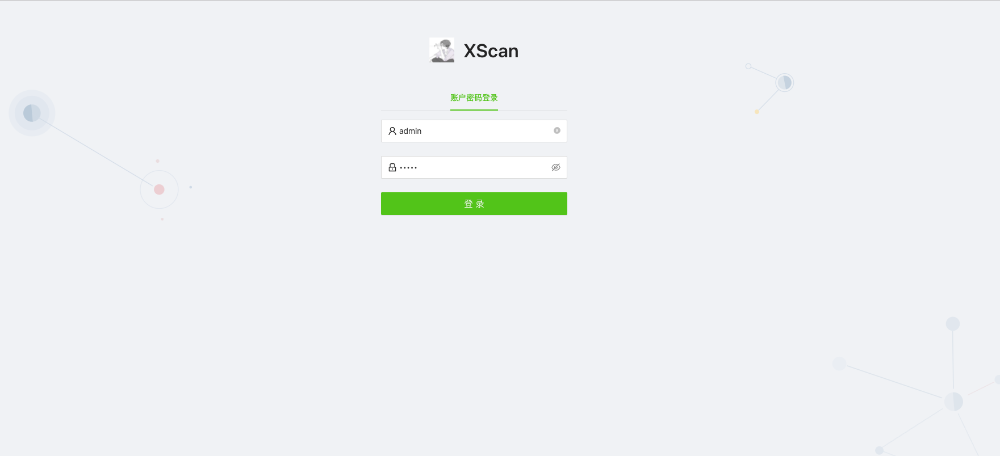

## 界面展示
#### 首页

#### 规则

#### 执行


## 使用指南

```
git clone 
cd XScan
docker-compose up -d
```
### 安装容器

```
curl -fsSL https://get.docker.com | sh  
systemctl restart docker  
systemctl enable docker  
wget https://github.com/docker/compose/releases/download/1.29.2/docker-compose-Linux-x86_64
sudo cp docker-compose-Linux-x86_64 /usr/bin/docker-compose
sudo chmod 777 /usr/bin/docker-compose
```

先查看服务器有没有运行当前扫描服务：

```
sudo docker ps -a
sudo docker stop xxx
sudo docker rm xxx
```
删除images
```
sudo docker images

sudo docker rmi xxx
```

部署 docker-compose启动
```
cd XScan
docker-compose up -d
```