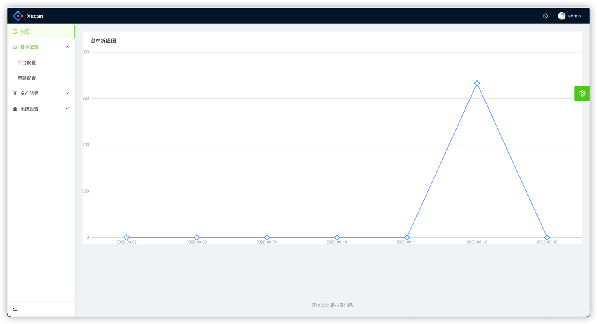
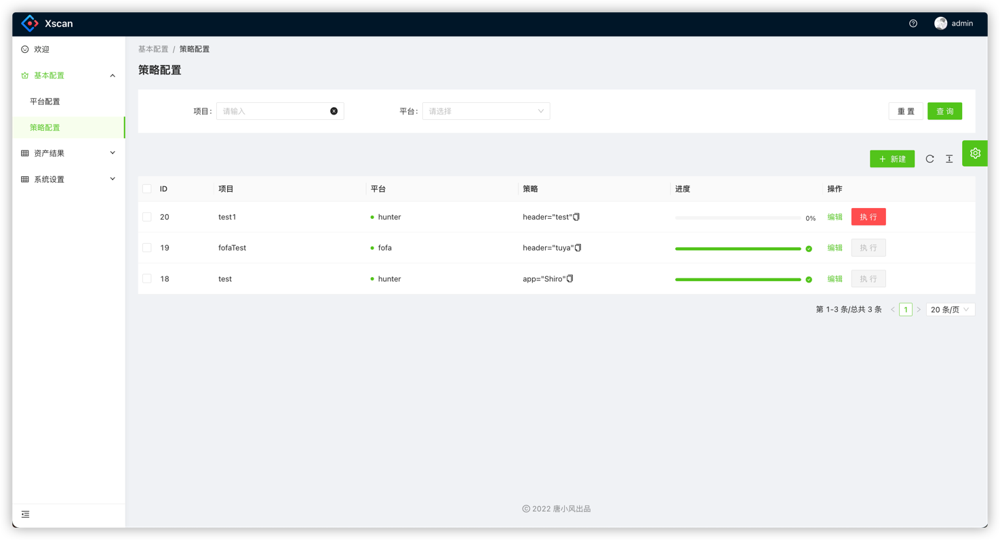
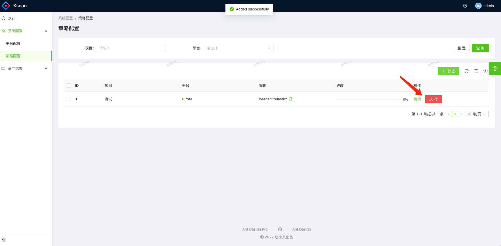
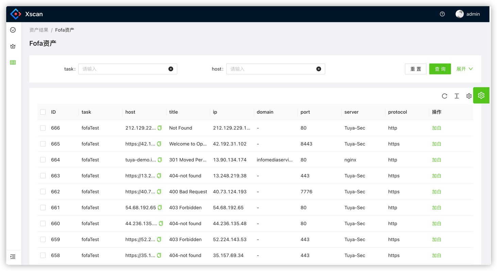
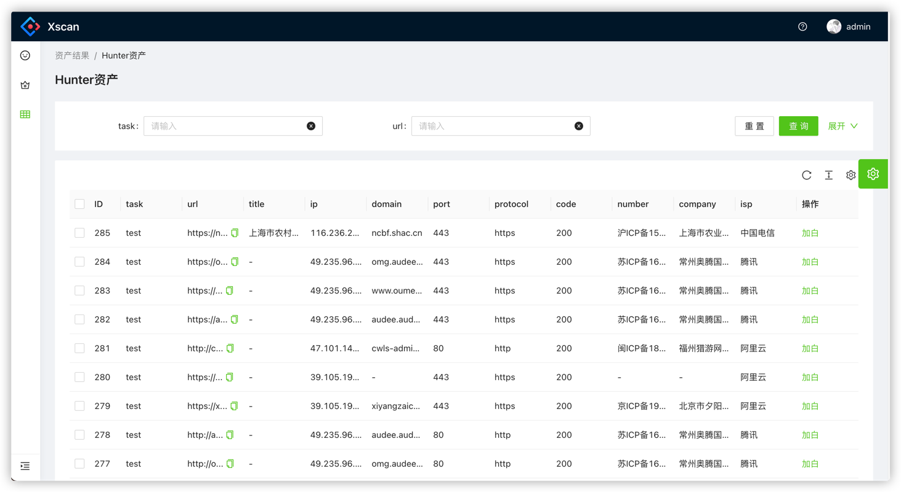
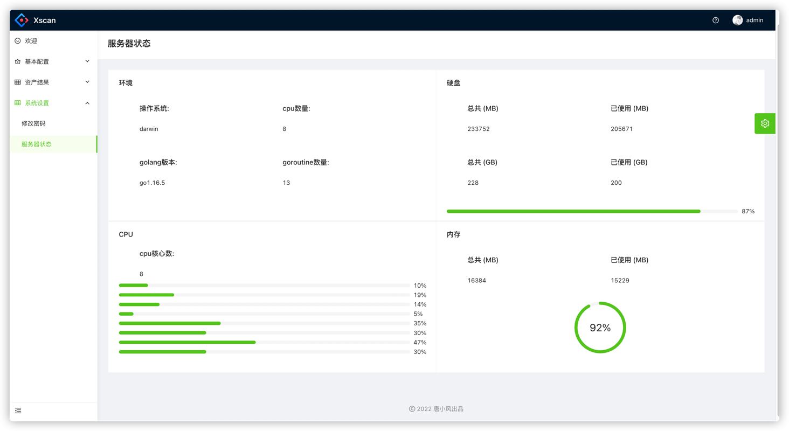

## 简介
一款取决于用户策略的资产管理平台

## 在线体验
http://103.146.179.91:8001
admin
admin
## 使用指南
```
git clone https://github.com/tangxiaofeng7/XScan.git
cd XScan
docker-compose up -d
```
#### 若安装过旧版本，可使用以下命令删除docker旧容器
```
docker stop $(docker ps -a | grep "xscan" | awk '{print $1}')
docker rm $(docker ps -a | grep "xscan" | awk '{print $1}')
docker rmi $(docker images | grep "scan" | awk '{print $3}')
```

## 界面截图
#### 欢迎界面

#### 策略详情

#### 执行策略

#### 资产结果


#### 平台状态


## 最近更新
[2022/3/17] 优化fofa查询出错提示</p>
[2022/3/15] 增加资产批量导出xlsx</p>
[2022/3/13] 增加修改密码，增加平台系统展示</p>
[2022/3/12] 增加Hunter支持</p>
[2022/3/11] 前端后端初始版本编写完成</p>